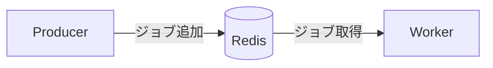

# BullMQ Sample Project

このプロジェクトは、BullMQ を使用して非同期ジョブを処理するサンプルです。

## セットアップ手順

### 1. Redis の準備

```bash
docker compose up -d
```

### 2. 必要なパッケージのインストール

```bash
npm install
```

## 使用方法

プロデューサーを実行（コンパイルなしでプロデューサーを起動）：

```bash
npm run dev:producer
```

ワーカーを実行（コンパイルなしでワーカーを起動）：

```bash
npm run dev:worker
```

producer はジョブをキューに追加します。

worker はそのジョブを処理します。



## ダッシュボードを起動

以下のコマンドを実行すると、bull-board のダッシュボードが起動します。

```bash
npm run dev:dashboard
```

http://localhost:3001/admin にアクセスすると、キューの状態をリアルタイムで確認できます 🎉
